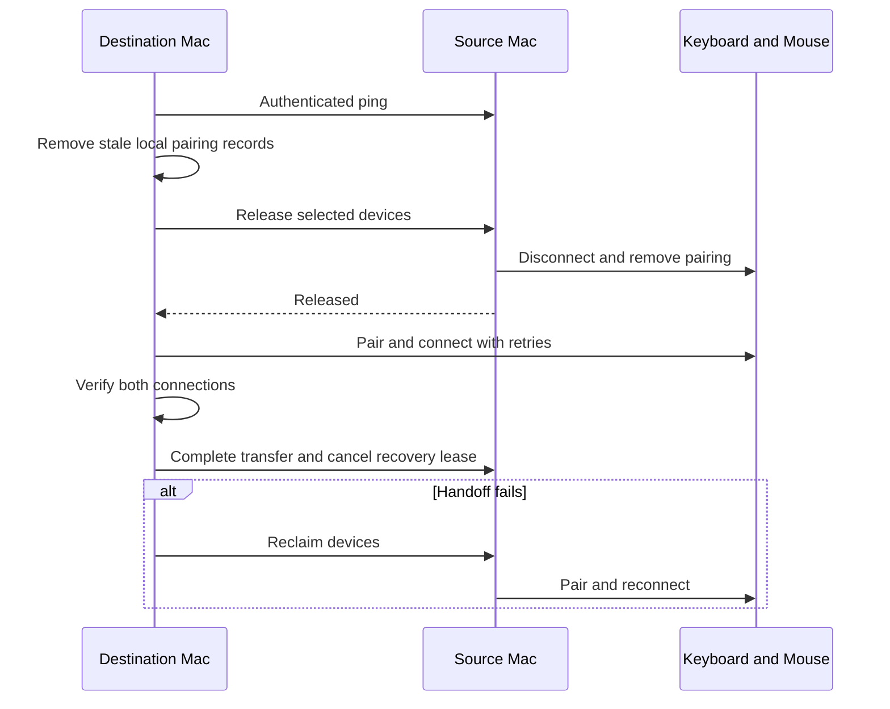

# MagicDock

MagicDock is an experimental, open-source macOS menu bar app that transfers a Magic Keyboard and
Magic Mouse between two Macs. Both copies of the app discover each other with Bonjour, coordinate
the Bluetooth handoff locally, and never require a cloud service.

> [!IMPORTANT]
> This is an MVP. macOS does not publish an API for removing a Bluetooth pairing record. MagicDock
> isolates the undocumented `IOBluetoothDevice.remove` selector used for that step. It works on
> current macOS versions, but Apple can change it without notice. Test with a backup input device
> nearby, and expect that an occasional Bluetooth failure may require switching a device off and on.

## What is included

- Native SwiftUI menu bar app for macOS 13 and later
- Automatic peer discovery over the local network
- Direct Bluetooth discovery, pairing, connection, disconnection, and removal
- A transaction-based handoff with retries, verification, and rollback
- Graceful device release on normal shutdown and automatic offline reclaim after startup
- Optional automatic handoff when moving the shared USB-C dock between Macs
- HMAC-SHA256 authenticated messages with timestamps, nonces, and replay protection
- Pairing secrets stored in the macOS Keychain
- Optional launch at login
- No analytics, account, backend, or external runtime dependency

## How it works



The Macs advertise `_magicdock._tcp` with Bonjour. Commands are length-prefixed JSON messages.
Every message is signed with a 256-bit shared key; an unsigned, expired, modified, or replayed
message is rejected. Traffic is authenticated but not encrypted, so the app must be used only on a
trusted local network.

After releasing the devices, the source Mac starts a three-minute recovery lease. A successful
destination sends a completion command that cancels it. If the network exchange dies mid-transfer,
the source makes a best-effort attempt to reclaim the keyboard and mouse when the lease expires.

For the one-Mac-at-a-time workflow, MagicDock delays normal app or system termination long enough
to remove the local pairings while Bluetooth is still available. When the other Mac starts later,
it waits eight seconds for peer discovery and then reclaims the released devices locally. A manual
**Take Offline Control** action is also available when the other Mac is not running.

With **Switch automatically with this dock** enabled, MagicDock treats an external display as a
dock connection. When that display and external power both disappear, the current Mac releases its
devices. When the display appears on the other Mac, that Mac waits briefly for peer discovery and
takes control. External power alone is deliberately treated as ambiguous, so a sleeping display
does not trigger a false handoff.

## Build

Requirements:

- macOS 13 Ventura or later
- Apple Command Line Tools or Xcode with Swift 6.2 or later

```sh
git clone https://github.com/LouisAyroles/MagicDock.git
cd MagicDock
make test
make app
```

The packaged app and ZIP archive are written to `dist/`. The local build is ad-hoc signed by
default. To use a Developer ID certificate, set `CODE_SIGN_IDENTITY` before running `make app`.

Install it on both Macs:

```sh
cp -R dist/MagicDock.app /Applications/
open /Applications/MagicDock.app
```

If Gatekeeper blocks a downloaded, non-notarized build, build from source or right-click the app
and choose **Open**. Official notarized releases are not part of the MVP yet.

## First-time setup

1. Cable-pair each Magic accessory with both Macs once. Pair the destination first and the Mac that
   should initially have control last.
2. Open MagicDock on both Macs and grant Bluetooth and Local Network access.
3. On the Mac currently connected to the keyboard and mouse, confirm both devices are selected.
4. Open **Secure pairing**, copy that Mac's key, and enter the same key on the other Mac.
5. Wait for the other Mac to appear. If needed, use **Sync from peer** to copy the device list.
6. Enable **Launch MagicDock at login** and **Auto-connect when the other Mac is off** on both Macs.
7. For a shared powered display dock, enable **Switch automatically with this dock** on both Macs.
8. On the destination Mac, click **Take Control** for the first test. Future dock moves are automatic.

The pairing key is generated locally, stored in Keychain, and never sent over the network. Sharing
the key is the explicit trust step between the two installations.

## Development

```sh
make build    # debug build
make test     # unit tests
make lint     # Swift format checks
make format   # apply formatting
make app      # release build, app bundle, signature, and ZIP
```

The package is split into a UI executable and `MagicDockCore`, which contains Bluetooth access,
peer authentication, framing, Bonjour transport, and the switch state machine. The core uses
protocols so the full handoff and rollback flows can be tested without touching real peripherals.

## Known limitations

- End-to-end reliability depends on the exact Magic device firmware and macOS Bluetooth stack.
- The private removal selector prevents Mac App Store distribution.
- Some keyboard pairing modes may display a six-digit passkey that must be typed on the keyboard.
- Both Macs must be awake and reachable on the same local network for a live handoff. Offline
  reclaim works after the previous owner completed a normal shutdown with MagicDock running.
- A forced power-off or force-quit cannot give MagicDock time to release the devices.
- The current build script produces a binary for the architecture of the Mac that runs it. Build on
  each Mac when mixing Apple silicon and Intel hardware.
- Automatic dock switching requires a dock or monitor that provides an external display signal.
  MagicDock also uses the loss of external power to confirm a disconnection and avoid false
  handoffs while the display sleeps.

## Security

See [SECURITY.md](SECURITY.md) for the threat model and vulnerability reporting process. MagicDock
accepts control commands only when their HMAC validates with the shared Keychain secret.

## Acknowledgements

The experimental unpairing approach was independently verified against
[`blueutil`](https://github.com/toy/blueutil), which also calls the undocumented `remove` selector
on `IOBluetoothDevice`.

## License

MagicDock is available under the [MIT License](LICENSE).
